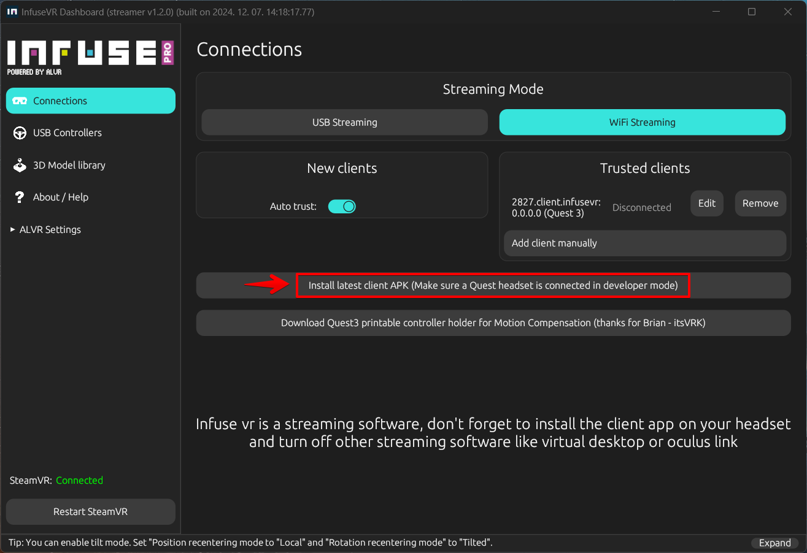
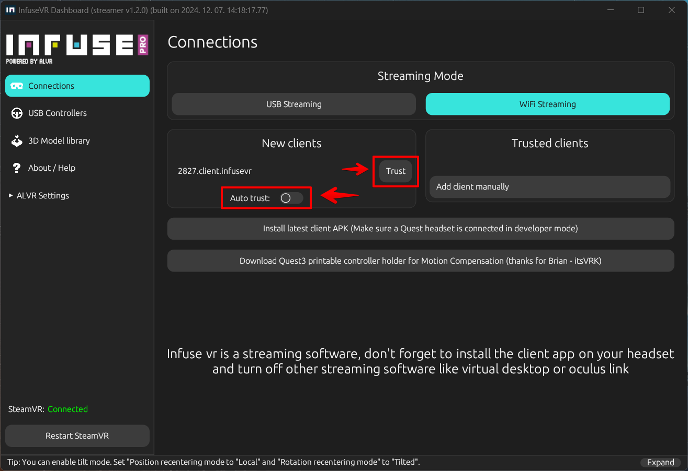
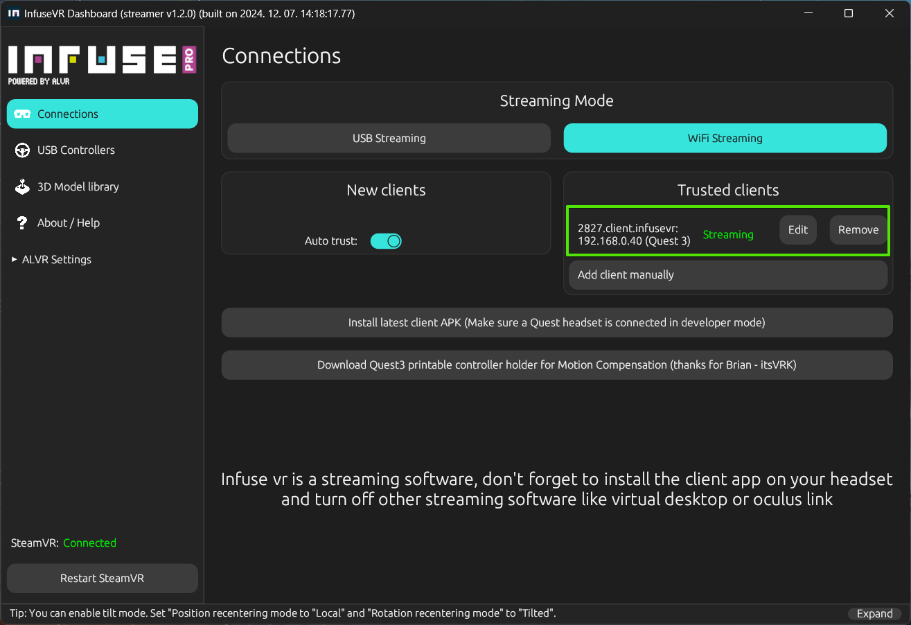
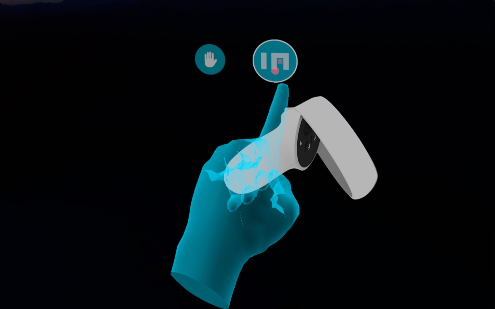
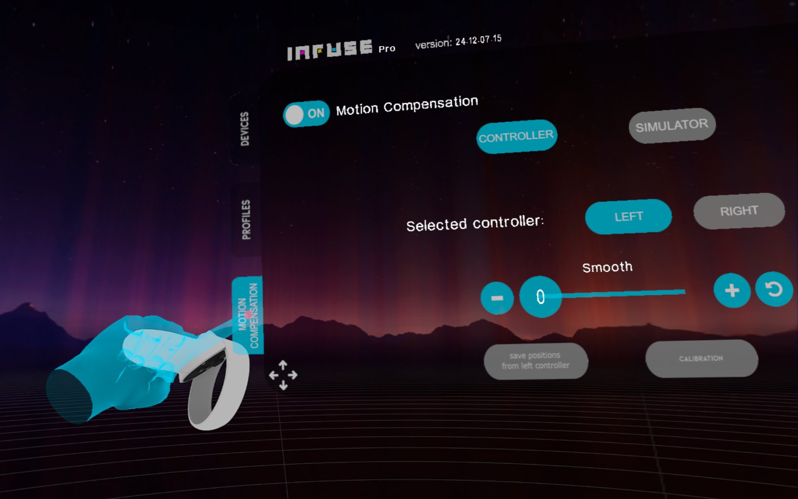

# Infuse VR
Infuse VR is a cutting-edge application designed for streaming VR content from a PC to wireless headsets like Meta Quest and Pico. It also offers motion compensation and comprehensive hand and gaming accessory visualization, making it an ideal solution for VR enthusiasts.

Infuse VR can be used independently of the Yaw Motion Simulator and is compatible with third-party motion software such as Sim Racing Studio

Infuse VR is a streaming software, don't forget to install the client app on your headset and turn off other streaming software like virtual desktop or oculus link!

Infuse VR addresses several key challenges in the VR space:

1. **Wireless PCVR**: Enables seamless video streaming to Android-based VR headsets.
2. **Motion Compensation**: Ensures smooth and stable video in relationship to simulator movement, reducing motion sickness and enhancing immersion.
3. **Hand and Gaming Accessory Visualization**: Provides detailed visualization of hands and gaming accessories within the virtual environment, improving control and awareness.

## Installation
To begin using Infuse VR, follow these steps:

1. **Install the Infuse VR Server on Your PC**:
	* Download and install the Infuse VR server application via Steam: <a href="https://store.steampowered.com/app/2532240/Infuse_VR/" target="_blank">https://store.steampowered.com/app/2532240/Infuse_VR/</a>
2. **Install the Infuse VR Client APK on Your Headset**:
	* Open InfuseVR, navigate to the Connections tab, and click the "Install latest APK" button with your headset connected in Developer mode.  
	

## Using Infuse VR

To start using Infuse VR:

1. **Launch the Infuse VR Application on Your PC**:
	* Steam and SteamVR will launch automatically. If installed, [Game Link](gamelink.md) will also load.
2. **Open the Infuse VR Client on Your Headset**:
	* Your headset will connect to the server and display the Steam VR environment.
3. **Computer and Headset on same network**:
    * Make sure both of the headset and your computer connected to the same network
	

	If the client doesn't appear in the client list, set your network to "private" and make sure that in "windows control panel/windows defender/allowed applications" section the "infusebackgroundserver" app is allowed on both private and public networks
	

4. **Trust the Client**:
    * From Infuse VR on Desktop push the "trust" button or check the "auto trust" checkbox.  
	
	* Now your client should appear on the Desktop applications "trusted clients" section, if not recheck step 3/4.  
	
5. **Configure in headset from Client**:
    * With both the Desktop application and the Infuse VR client loaded, put on your headset and look at to the right. Push the infuse vr (in) logo.  
6. **Configure Client settings**:
    * The settings panel will appear.  
	
7. **Using Infuse VR features**:
    * See [Enabling Motion Compensation](#enabling-motion-compensation) or [Hand and Gaming Accessory Visualization](#hand-and-gaming-accessory-visualization) below.
9. **Load a Game**:
	* Load a game via the SteamVR dashboard or Game Link and enjoy!

## Enabling Motion Compensation

For accurate motion compensation, we recommend using controller-based motion compensation with 3D printable controller mounts:

* <a href="https://makerworld.com/en/models/709270" target=_blank">Quest3 Controller Mount for VR Motion Compensation</a>

To enable motion compensation in Infuse VR:

1. **Access the Infuse VR Dashboard within VR**:
	* Tap on the Infuse VR icon within the VR view to open the dashboard.
    
2. **Enable Motion Compensation**:
	* Click on the "Motion Compensation" tab.
	* Adjust settings according to your preference.
    
3. **Save and Apply Changes**:
	* Click "Apply" or "OK" to save your settings.

